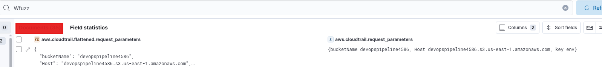
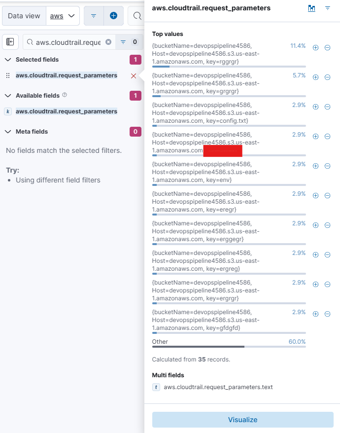
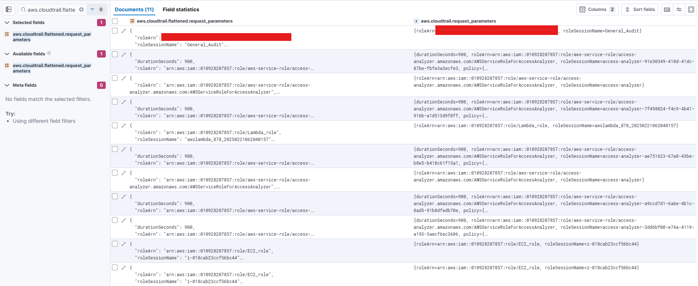
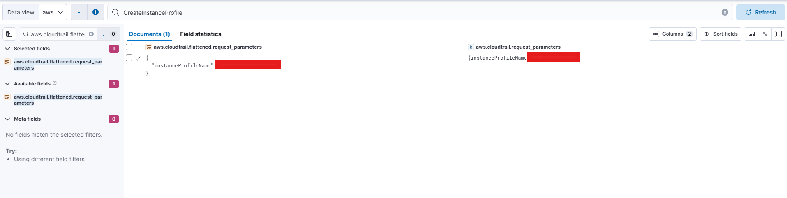
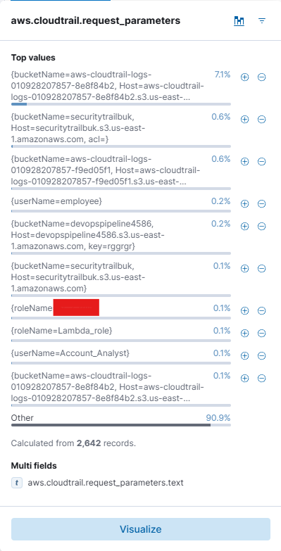
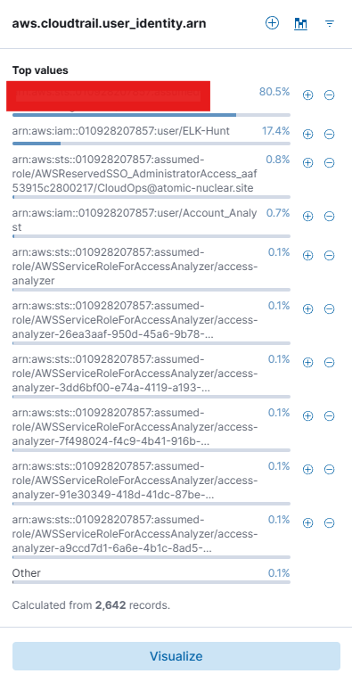
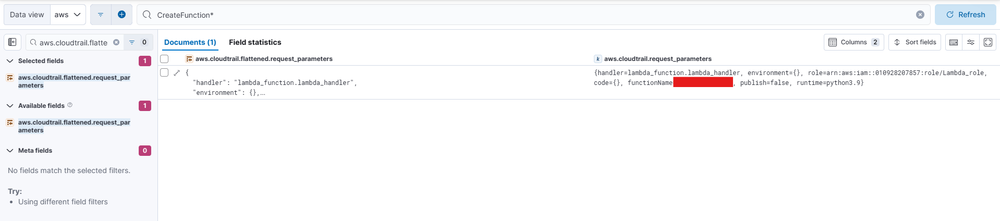
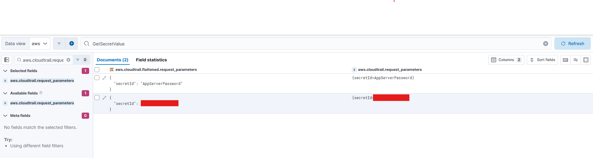
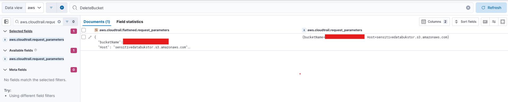
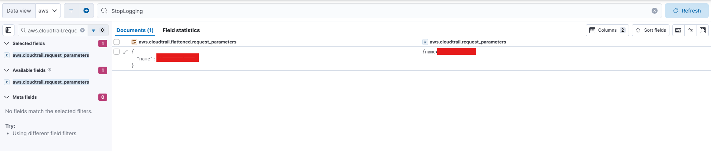

## 📘 MCBTA - AWS Investigation Report

**Analyst**: Renan - D3Z33  
**Course**: Multi-Cloud Blue Team Analyst (MCBTA)  
**Cloud**: Amazon Web Services (AWS)  
**Standard References**: ISO/IEC 27001 • NIST CSF • CIS Controls • MITRE ATT&CK

---

### 🧪 Instructions

To become a certified **Multi-Cloud Blue Team Analyst**, the ultimate goal is to investigate various attack scenarios using the **SIEM: ELK Console**. The investigation involves analyzing multiple attacks targeting **AWS**, **Azure**, and **GCP** environments.

Successfully completing the module requires solving all three cloud-specific challenges outlined below:

- 🧩 All gamified, flag-based challenges come with unlimited attempts, allowing you to refine your investigation skills without restrictions.  
- ❌ There are no negative points for incorrect attempts, ensuring a risk-free learning experience.  
- ⏱️ Additionally, there are no time constraints, giving you the flexibility to analyze attack scenarios at your own pace and thoroughly investigate each challenge.

---

### 🔐 LAB ACCESS

- **USERNAME**: `***************`  
- **PASSWORD**: `***************`  
- **SIEM URL**: `****://*******************/*****`

> 🔍 Acesse e logue com suas credenciais.  
> 📂 Clique nas **três barras** ao lado superior esquerdo e vá para `Discover`.  
> ☁️ Escolha o **Data View** da prova que irá fazer, neste caso: `AWS`.

---

### ✅ Investigated Events (Q01–Q10)

> Todas as evidências foram coletadas via **Kibana** e analisadas conforme boas práticas de **análise forense em ambientes cloud**.

---

### 🔎 Q1 — Determine the count of subdomain enumeration attempts detected against the public S3 bucket `devopspipeline4586`

**Hint**: Investigate event logs associated with Wfuzz operations.

#### 🧠 Análise
Tentativas de enumeração de subdomínios geralmente utilizam ferramentas como Wfuzz para descobrir objetos em buckets públicos da AWS. Identificar essas ações pode indicar uma fase de reconhecimento por parte do atacante.

#### 🔍 Procedimento realizado:

1. Acessamos o `Discover` e selecionamos o data view da AWS.
2. Na barra de pesquisa principal, buscamos por:
   ```
   Wfuzz
   ```
3. Identificamos múltiplos eventos associados ao bucket `devopspipeline4586`, oriundos de solicitações automatizadas.

#### ✅ Resultado
A imagem a seguir mostra os eventos detectados que indicam tentativas de enumeração:



> A enumeração via Wfuzz pode ser um precursor para exploração. Monitorar padrões de requisição anômalos é essencial para detecção precoce.

---

### 🔎 Q2 — Identify & name the bucket objects successfully discovered through subdomain enumeration by an attacker

**Hint**: Analyze `aws.cloudtrail.request_parameters` to identify the enumerated object.

#### 🧠 Análise
Após identificar a enumeração do bucket, é importante verificar quais objetos foram efetivamente descobertos pelo atacante — isso indica sucesso parcial ou total na exfiltração de dados.

#### 🔍 Procedimento realizado:

1. Na aba de campos à esquerda, buscamos por:
   ```
   aws.cloudtrail.request_parameters
   ```
2. Expandimos os resultados para visualizar os objetos acessados com sucesso no bucket `devopspipeline4586`.

#### ✅ Resultado
A imagem abaixo mostra claramente os nomes dos objetos que foram descobertos:



> A exposição de arquivos por meio de buckets públicos sem controle de acesso pode causar vazamento de dados sensíveis.

---

### 🔎 Q3 — Identify and determine the user `roleArn` that was successfully assumed

**Hint**: Check `aws.cloudtrail.flattened.request_parameters` for `AssumeRole` activity to determine the assumed user.

#### 🧠 Análise
O evento `AssumeRole` indica uma tentativa de assumir permissões de outro usuário/serviço. Essa técnica pode ser usada para escalonamento de privilégios ou movimentação lateral dentro do ambiente AWS.

#### 🔍 Procedimento realizado:

1. No painel de campos à esquerda, aplicamos o filtro:
   ```
   aws.cloudtrail.flattened.request_parameters
   ```
2. No campo de pesquisa principal, utilizamos:
   ```
   AssumeRole
   ```
3. Com isso, localizamos o `roleArn` da identidade que foi assumida com sucesso.

#### ✅ Resultado
A imagem a seguir apresenta o `roleArn` envolvido no evento:



> Atividades de `AssumeRole` devem ser auditadas com atenção, pois representam mudança de contexto de identidade — um vetor comum em ataques sofisticados.

---

### 🔎 Q4 — Determine the name of the instance profile associated with a suspicious creation event

**Hint**: Check `aws.cloudtrail.flattened.request_parameters` to identify details related to the `CreateInstanceProfile` event.

#### 🧠 Análise
Criações suspeitas de `InstanceProfile` podem indicar preparação para atribuição de permissões a instâncias EC2. Identificar o nome criado ajuda a rastrear e validar intenções legítimas.

#### 🔍 Procedimento realizado:

1. No painel `Discover`, filtramos o campo:
   ```
   aws.cloudtrail.flattened.request_parameters
   ```
2. Aplicamos a busca por:
   ```
   CreateInstanceProfile
   ```
3. O nome do perfil de instância foi identificado diretamente nos parâmetros da requisição.

#### ✅ Resultado
A imagem abaixo mostra o `InstanceProfile` criado durante a operação:



> Monitorar esse tipo de criação ajuda a detectar perfis que podem ser usados para escalar privilégios em instâncias EC2.

---

### 🔎 Q5 — Identify the IAM role name associated with the `AddRoleToInstanceProfile` event

**Hint**: Investigate `aws.cloudtrail.request_parameters` to identify the role associated with `AddRoleToInstanceProfile`.

#### 🧠 Análise
Essa atividade conecta um IAM Role ao Instance Profile, podendo fornecer à instância EC2 acesso a recursos críticos.

#### 🔍 Procedimento realizado:

1. Acessamos o campo:
   ```
   aws.cloudtrail.request_parameters
   ```
2. Inspecionamos os eventos `AddRoleToInstanceProfile`.
3. A role associada foi revelada no conteúdo JSON dos parâmetros.

#### ✅ Resultado
A imagem a seguir mostra a role IAM utilizada na operação:



> O uso de `AddRoleToInstanceProfile` deve ser auditado com rigidez, pois define a identidade que será assumida por instâncias EC2.

---

### 🔎 Q6 — Retrieve the `user_identity.arn` associated with the access key generation activity

**Hint**: Review `aws.cloudtrail.user_identity.arn` to identify the ARN responsible for access key creation.

#### 🧠 Análise
Geração de chaves de acesso (access keys) pode indicar criação de credenciais permanentes — comportamento frequentemente associado à persistência em nuvem.

#### 🔍 Procedimento realizado:

1. Filtramos no campo lateral:
   ```
   aws.cloudtrail.user_identity.arn
   ```
2. Verificamos os logs relacionados à criação de access keys.
3. Identificamos o `ARN` do usuário envolvido.

#### ✅ Resultado
A imagem abaixo mostra o ARN associado ao evento de criação de chave:



> A criação de access keys deve ser monitorada constantemente, especialmente em contextos de usuários privilegiados.

---

### 🔎 Q7 — Identify the specific function name used during the `CreateFunction` request

**Hint**: Check `aws.cloudtrail.flattened.request_parameters` to identify details related to `CreateFunction*`.

#### 🧠 Análise
Criação de funções Lambda pode ser usada para executar código malicioso ou automatizar tarefas dentro da AWS.

#### 🔍 Procedimento realizado:

1. No painel lateral, filtramos:
   ```
   aws.cloudtrail.flattened.request_parameters
   ```
2. No campo principal, buscamos por:
   ```
   CreateFunction*
   ```
3. Identificamos o nome da função Lambda criada.

#### ✅ Resultado
A imagem a seguir mostra a função criada via evento `CreateFunction`:



> Funções Lambda maliciosas são comuns em ataques avançados. Identificar nomes suspeitos é essencial para resposta rápida.

---

### 🔎 Q8 — Determine the `secretId` value which is associated with the `GetSecretValue` event action

**Hint**: Investigate `aws.cloudtrail.request_parameters` associated with `GetSecretValue`.

#### 🧠 Análise
O evento `GetSecretValue` é um forte indicativo de tentativa de exfiltração de segredos. Identificar o `secretId` envolvido é crucial para validar o comprometimento.

#### 🔍 Procedimento realizado:

1. No Kibana, filtramos o campo:
   ```
   aws.cloudtrail.request_parameters
   ```
2. Em seguida, buscamos por:
   ```
   GetSecretValue
   ```
3. Localizamos o valor do campo `secretId` vinculado à tentativa de leitura de segredo.

#### ✅ Resultado
A imagem abaixo exibe o `secretId` acessado:



> Atividades de leitura de segredo devem acionar alertas imediatos — especialmente quando não são esperadas naquele contexto operacional.

---

### 🔎 Q9 — Analyze and extract the storage bucket name associated with the deletion event

**Hint**: Investigate `aws.cloudtrail.request_parameters` associated with `DeleteBucket`.

#### 🧠 Análise
Deleções de buckets S3 representam possíveis tentativas de ofuscação, destruição de evidências ou sabotagem.

#### 🔍 Procedimento realizado:

1. Filtramos pelo campo:
   ```
   aws.cloudtrail.request_parameters
   ```
2. Aplicamos o termo de busca:
   ```
   DeleteBucket
   ```
3. Identificamos o nome do bucket que foi alvo da deleção.

#### ✅ Resultado
A imagem abaixo mostra o bucket S3 deletado:



> Toda ação de deleção de bucket precisa ser validada com contexto. Caso injustificada, deve ser tratada como incidente.

---

### 🔎 Q10 — Identify the CloudTrail name linked to the `StopLogging` activity

**Hint**: Investigate `aws.cloudtrail.request_parameters` associated with `StopLogging`.

#### 🧠 Análise
Atividades `StopLogging` têm como objetivo interromper a auditoria — um comportamento típico de evasão. Identificar o trail afetado é prioridade.

#### 🔍 Procedimento realizado:

1. Acessamos o campo:
   ```
   aws.cloudtrail.request_parameters
   ```
2. Pesquisamos por:
   ```
   StopLogging
   ```
3. Dentro do log, localizamos o nome do CloudTrail afetado.

#### ✅ Resultado
A imagem a seguir mostra o trail com logging interrompido:



> Esse tipo de atividade pode indicar comprometimento. Deve ser correlacionada com eventos anteriores de privilege escalation ou movimentações laterais.

---

## 🧾 Conclusão

Durante esta trilha do módulo **AWS** na certificação **MCBTA - Multi-Cloud Blue Team Analyst**, conduzimos uma investigação detalhada de dez cenários distintos, simulando ações maliciosas no ambiente da **Amazon Web Services**. Através do SIEM baseado em **ELK Stack**, exploramos dados valiosos registrados pelo **CloudTrail**, identificando:

- Enumeradores automatizados acessando buckets públicos;
- Criação de credenciais e funções potencialmente maliciosas;
- Exfiltração de segredos via `GetSecretValue`;
- Deleções suspeitas de buckets e interrupções de monitoramento com `StopLogging`.

Cada evento foi cuidadosamente correlacionado e documentado, mantendo alto rigor técnico e aderência aos padrões internacionais de segurança. Todas as ações foram tratadas com mentalidade **Blue Team**: focadas em detecção, resposta e mitigação de ameaças em ambientes **multi-cloud**.

---
